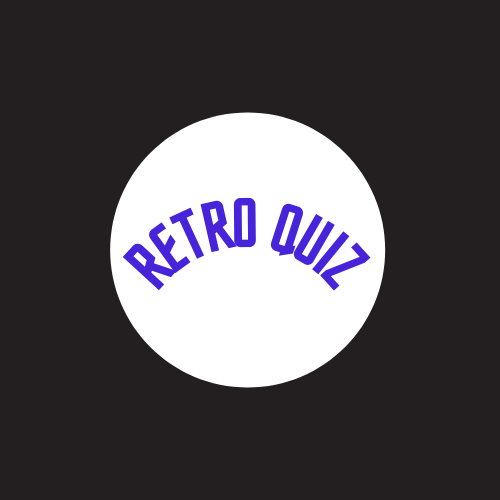
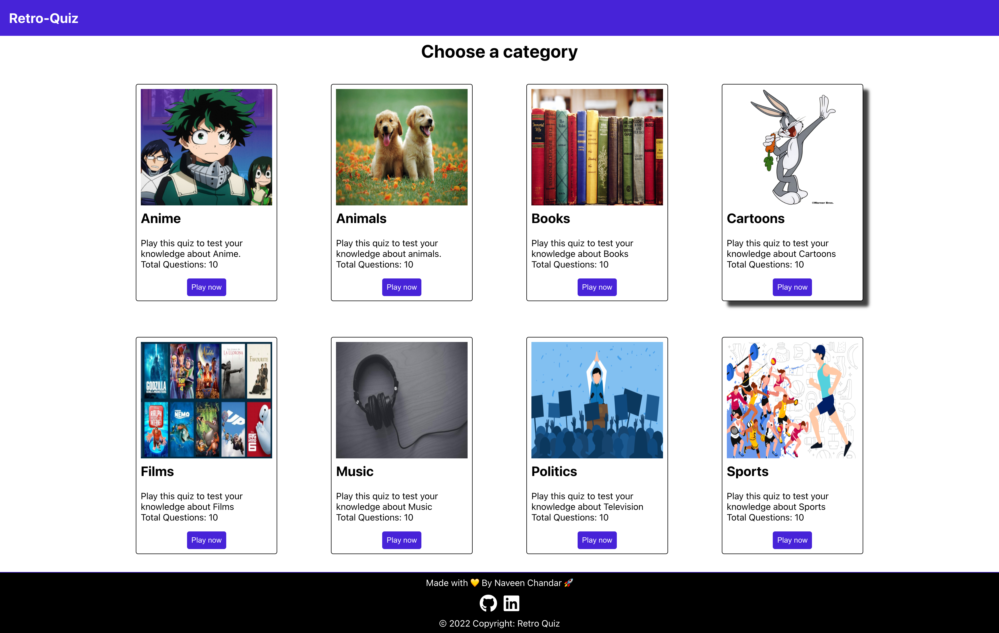
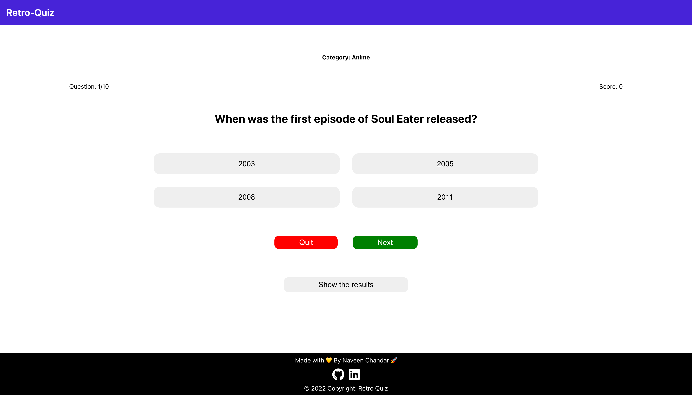

<p align="center">
  <a href="" rel="noopener">
 </a>
</p>

<h3 align="center">Retro Quiz</h3>

<div align="center">

[]()
[](https://github.com/Naveenchandar/retro-quiz/issues)
[](https://github.com/Naveenchandar/retro-quiz/pulls)
[](/LICENSE)

</div>

---

<p align="center"> R E T R O - Q U I Z.
    <br> 
</p>

## 📝 Table of Contents

- [About](#about)
- [Demo](#demo)
- [Getting Started](#getting_started)
- [Screenshot](#screenshot)
- [Features](#features)
- [Deployment](#deployment)
- [Built Using](#built_using)
- [Authors](#author)
- [Contribution](#contribution)
- [Upcoming Features](#upcomingfeatures)

## 🧐 About <a name = "about"></a>

Retro Quiz - A Quiz App. This consists of varieties of quiz on various categories. Feel free to test your knowledge.

## Demo <a name = "demo"></a>
Please visit this [link](https://retro-quiz.netlify.app/).

## 🏁 Getting Started <a name = "getting_started"></a>

To run locally, run below command in git terminal.

```
git clone https://github.com/Naveenchandar/retro-quiz.git
```
Once done with cloning, run `npm start` in command line. You're good to go 🎉.

## Screenshot <a name = "screenshot"></a>



## Features <a name="features"></a>

- Home Page
    - Contains landing page with the featured categories.
- Quizzes by Category
    - By selecting category, User will be redirected to the rules page with the selected category.
- Rules Page for while attempting Quiz
    - Contains rules for the particular quiz.
- MCQ based Quiz Question Page
    - User can see a question with multiple options to pick from.
- Result Page with Answers & Score
    - Once User completes the quiz, user can view the result page containing scores and answers.

## 🚀 Deployment <a name = "deployment"></a>

- [Netlify](https://www.netlify.com/) - Netlify

## ⛏️ Built Using <a name = "built_using"></a>

- [HTML](https://developer.mozilla.org/en-US/docs/Web/HTML)
- [CSS](https://developer.mozilla.org/en-US/docs/Web/CSS)
- [Javascript](https://developer.mozilla.org/en-US/docs/Web/JavaScript)
- [React](https://reactjs.org/)

## ✍️ Author <a name = "author"></a>

- [@Naveenchandar](https://github.com/Naveenchandar) - Idea & Initial work

## ✍️ Contribution <a name = "contribution"></a>

1. Fork the project
2. Create your feature branch (`git checkout -b feature/branch`).
3. Perfom desired changes needed to the code base.
4. Stage all your changes (`git add .`)
3. Commit your changes with a proper commit message (`git commit -m 'Add some feature'`)
4. Push the changes to your branch (`git push origin feature/branch`)
5. Open new pull request
6. Add appropriate title and description to your pull request explaining your changes and efforts done.

NOTE: Be sure to merge the latest from "upstream" before making a pull request!

## 🎉 Upcoming Features <a name = "upcomingfeatures"></a>

- Dark / Light Mode
- Selection of levels

***show some love by [starring](https://github.com/Naveenchandar/retro-quiz) this repo.***